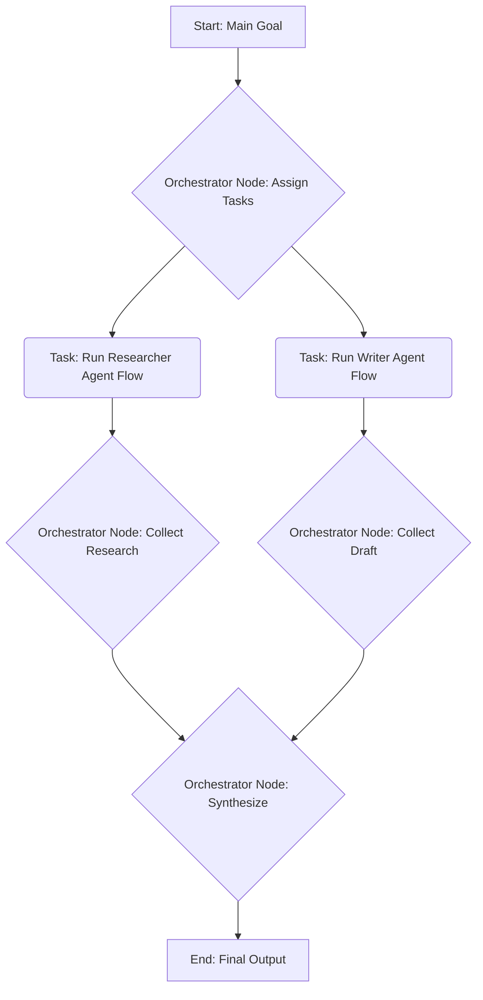

# Design Pattern: Multi-Agent System

A multi-agent system involves multiple independent agents collaborating or competing to achieve a goal.

## Concept in PocketFlex

Implementing a multi-agent system in PocketFlex and Elixir involves orchestrating multiple, potentially concurrent, PocketFlex flows or agentic processes.

Several approaches are possible:

1.  **Orchestrator Flow**: 
    *   A main PocketFlex flow acts as the orchestrator.
    *   Specific nodes within this flow are responsible for launching other PocketFlex flows (representing individual agents) perhaps using `Task.async` or by starting supervised `GenServer` processes that run the agent flows.
    *   The orchestrator node waits for results from the agent flows (e.g., via `Task.await`, message passing from `GenServer`s) and manages their interaction or aggregates their results.
    *   Communication between agents might happen indirectly via updates to a shared resource (like a database or ETS table) managed or monitored by the orchestrator, or via direct message passing if using stateful processes like `GenServer`s.

2.  **Independent Flows with Shared Resources**: 
    *   Multiple PocketFlex flows run independently (potentially as separate OTP applications or supervised processes).
    *   They coordinate or communicate by reading from and writing to shared resources (e.g., a database, a shared ETS table, a message queue like RabbitMQ).
    *   Each flow might represent an agent with a specific role (e.g., Researcher Agent, Writer Agent, Reviewer Agent).

3.  **Agent Processes (GenServers)**:
    *   Each agent is implemented as a `GenServer` or similar OTP process.
    *   The agent's internal logic might be implemented using a PocketFlex flow, which the `GenServer` runs via `PocketFlex.run/2` in its message handlers.
    *   Agents communicate by sending messages (`GenServer.call/3`, `GenServer.cast/2`) to each other, possibly managed via Elixir's `Registry` for discovery.

## Example Flow (Orchestrator Approach)

## Implementation Notes

- **Concurrency Model**: Choose the right Elixir concurrency mechanism (`Task`, `GenServer`, `Registry`) based on the required agent lifetime, state management needs, and communication patterns.
- **Communication**: Define clear communication protocols between agents, whether via shared state, message passing, or shared external resources.
- **State Management**: If agents are stateful (e.g., `GenServer`s), manage their state carefully. If using shared resources like databases or ETS, handle potential concurrency issues (race conditions, locking).
- **Supervision**: If running multiple agent flows as processes, use OTP Supervisors to ensure fault tolerance and manage the lifecycle of agent processes.
- **Complexity**: Multi-agent systems can become complex quickly. Start simple and clearly define the roles and interactions of each agent.

PocketFlex provides the building blocks (nodes, flows) for agent logic, while Elixir/OTP provides the powerful concurrency and fault-tolerance mechanisms needed to orchestrate multiple agents effectively. 