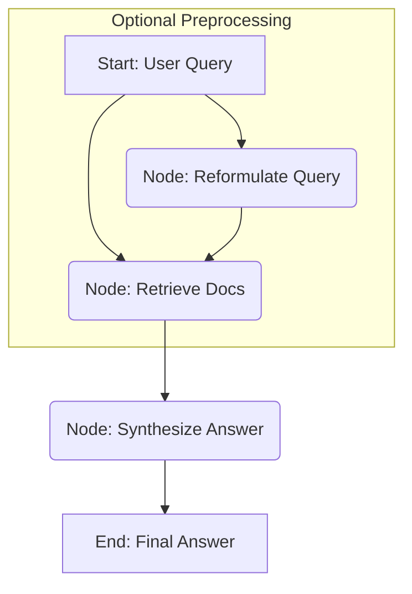

# Design Pattern: RAG (Retrieval-Augmented Generation)

RAG combines information retrieval with large language model (LLM) generation to produce answers grounded in external knowledge.

## Concept in PocketFlex

A RAG pipeline in PocketFlex is typically implemented as a flow with distinct [Nodes](../core_abstraction/node.md) for each stage:

1.  **Query Formulation Node (Optional)**: Takes the initial user query from the [Shared State](../core_abstraction/communication.md) and potentially reformulates it (using an LLM via a utility like `LLMCaller`) into a better query for retrieval.
2.  **Retrieval Node**: 
    *   Takes the (possibly reformulated) query.
    *   Uses a utility function to search a knowledge base (e.g., a vector store like ChromaDB, Qdrant, or a traditional search index like Elasticsearch) for relevant documents/text chunks.
    *   This utility might involve generating embeddings (potentially using LangchainEx embeddings modules) and performing similarity searches.
    *   Adds the retrieved documents/chunks to the shared state.
3.  **Synthesis Node**: 
    *   Takes the original query and the retrieved documents from the shared state.
    *   Constructs a prompt for an LLM, including the query and the retrieved context.
    *   Uses an LLM utility (like `LLMCaller`) to generate an answer based *only* on the provided context.
    *   Adds the final generated answer to the shared state.

## Example Flow

## Implementation Notes

- **Indexing (Offline Process)**: The knowledge base (e.g., vector store) needs to be populated beforehand. This involves:
    - Loading documents (using Elixir file reading, HTTP clients like `Req`, or LangchainEx `DocumentLoaders`).
    - Splitting documents into chunks (using custom logic or LangchainEx `TextSplitters`).
    - Generating embeddings for each chunk (using an embedding model via LangchainEx or another library).
    - Storing the chunks and their embeddings in the chosen vector store/index.
- **Retrieval Utility**: The `exec/1` function of the Retrieval Node calls a utility that encapsulates the logic for:
    - Generating an embedding for the input query.
    - Performing a similarity search against the vector store.
    - Returning the relevant document chunks.
- **Synthesis Node Prompt**: The prompt engineering for the Synthesis Node is crucial. It must instruct the LLM to base its answer strictly on the retrieved context provided in the prompt to avoid hallucination and ensure grounding.
- **Error Handling**: Implement error handling in the [Control Flow](../core_abstraction/control_flow.md) for cases like retrieval failure or LLM errors during synthesis.

Building RAG with PocketFlex involves composing these specialized nodes, leveraging external Elixir libraries or custom utilities for tasks like embedding generation and vector search within the node implementations. 