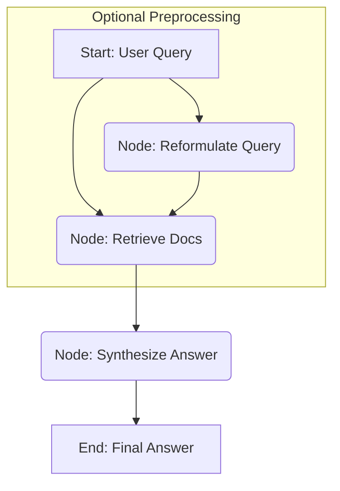

# Design Pattern: RAG (Retrieval-Augmented Generation)

RAG combines information retrieval with large language model (LLM) generation to produce answers grounded in external knowledge.

## Concept in PocketFlex

A RAG pipeline in PocketFlex is typically implemented as a flow with distinct [Nodes](../core_abstraction/node.md) for each stage:

1.  **Query Formulation Node (Optional)**: Takes the initial user query from the [Shared State](../core_abstraction/communication.md) and potentially reformulates it (using an LLM via a utility like `LLMCaller`) into a better query for retrieval.
2.  **Retrieval Node**: 
    *   Takes the (possibly reformulated) query.
    *   Uses a utility function to search a knowledge base (e.g., a vector store like ChromaDB, Qdrant, or a traditional search index like Elasticsearch) for relevant documents/text chunks.
    *   This utility might involve generating embeddings (potentially using LangchainEx embeddings modules) and performing similarity searches.
    *   Adds the retrieved documents/chunks to the shared state.
3.  **Synthesis Node**: 
    *   Takes the original query and the retrieved documents from the shared state.
    *   Constructs a prompt for an LLM, including the query and the retrieved context.
    *   Uses an LLM utility (like `LLMCaller`) to generate an answer based *only* on the provided context.
    *   Adds the final generated answer to the shared state.

## Example Flow



## Implementation Notes

- **Leverage the `rag` Library**: Use [`rag`](https://hexdocs.pm/rag/Rag.html) to scaffold your RAG system. Install with `{:rag, ">= 0.2.2"}` in `mix.exs` and run `mix rag.install --vector-store <pgvector|chroma>` to generate ingestion, retrieval, and generation modules.
- **Ingestion Pipeline**: The installer provides a pipeline for reading `.txt` (or other) files, chunking, embedding, and storing in your vector store (e.g., pgvector, chroma). Extend the ingestion script to handle your file types (Elixir, Markdown, etc.) as needed.
- **PocketFlex Integration**: Implement RAG as one or more PocketFlex nodes:
    - **Retrieval Node**: The `exec/1` function should call your retrieval utility (from the generated `rag` module), passing the query from shared state, and return the retrieved chunks in the result. Example:
      ```elixir
      def exec({:ok, %{query: query}}) do
        case MyApp.Rag.retrieve(query) do
          {:ok, docs} -> {:ok, %{docs: docs}}
          {:error, reason} -> {:error, reason}
        end
      end
      ```
    - **Synthesis Node**: The `exec/1` function should assemble the prompt from the query and retrieved docs, then call your LLM utility/module. Example:
      ```elixir
      def exec({:ok, %{query: query, docs: docs}}) do
        prompt = MyApp.Rag.build_prompt(query, docs)
        case MyApp.LLM.call(prompt) do
          {:ok, answer} -> {:ok, %{answer: answer}}
          {:error, reason} -> {:error, reason}
        end
      end
      ```
    - **Error Handling**: Use pattern matching in `exec/1` and propagate `{:error, reason}` tuples for robust flow control.
    - **State Shape**: Clearly document expected keys (e.g., `:query`, `:docs`, `:answer`) for each node.
- **Vector Store**: `rag` does not abstract vector stores—work directly with your chosen store. Generated code supports hybrid retrieval (semantic + fulltext) and can be customized.
- **Retrieval**: Implement retrieval functions that use embeddings and/or fulltext search. Use `rag`'s utilities for result fusion (e.g., Reciprocal Rank Fusion), concatenation, and deduplication. You can combine multiple retrieval sources.
- **Generation**: After retrieval, construct prompts from the query and retrieved chunks. Use your preferred LLM serving (Nx.Serving, Ollama, LangchainEx, or external API). `rag` supports prompt assembly and context management, and can be integrated with other libraries for generation.
- **Evaluation**: Use the generated evaluation script (`mix rag.gen_eval`) to benchmark your RAG pipeline. Adapt it to your domain for best results.
- **Telemetry**: `rag` emits telemetry events for each pipeline step—use these for monitoring, debugging, and UX improvements.
- **Extensibility**: You can swap out or extend any step (chunking, embedding, retrieval, generation) as needed. `rag` is modular and works well with Elixir idioms and OTP patterns.

### Example Integration with LangchainEx

- Use the retrieval output to augment user messages or prompts for LangchainEx or other LLM libraries. See [Bitcrowd's blog post](https://bitcrowd.dev/a-rag-library-for-elixir) for a real-world integration example.

```elixir
# Example: Augmenting a user message with retrieved context
defp augment_user_message(user_message) do
  %{role: :user, content: query} = user_message
  rag_generation = Chatbot.Rag.build_generation(query)
  {:ok, %{user_message | content: rag_generation.prompt}, rag_generation}
end
```

- You can use this pattern to feed context into any LLM pipeline.

### Additional Recommendations
- Always document the state shape and transitions for each node.
- Handle errors at each step (ingestion, retrieval, generation) and propagate error atoms in the flow.
- Use explicit citations in generated answers when possible.
- Continuously evaluate and monitor your RAG system for quality and performance.

## Best Practices

- Separate retrieval and synthesis logic for testability.
- Use clear state keys for query, docs, and answer.
- Document the shape of state at each step.

## References
- See [Node](../core_abstraction/node.md) for node lifecycle.
- See [Control Flow](../core_abstraction/control_flow.md) for orchestration.
- See [MapReduce](./mapreduce.md) for concurrent retrieval/synthesis.

Building RAG with PocketFlex involves composing these specialized nodes, leveraging external Elixir libraries or custom utilities for tasks like embedding generation and vector search within the node implementations. 