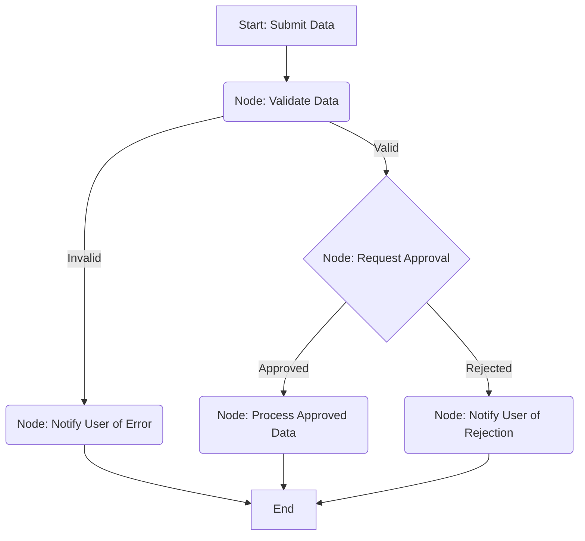

# Design Pattern: Workflow

A workflow represents a more complex sequence of tasks with potential branching, conditions, and loops, often orchestrating multiple simpler patterns.

## Concept in PocketFlex

A workflow in PocketFlex is simply a well-defined **Flow** composed of multiple [Nodes](../core_abstraction/node.md) connected via specific [Control Flow](../core_abstraction/control_flow.md) transitions.

Key elements for building complex workflows include:

- **Conditional Transitions**: A node's `post/3` function can return different `next_action_atom` values based on the `exec/1` result or data in the [Shared State](../core_abstraction/communication.md). The flow definition maps these atoms to different downstream nodes, creating branches.
- **Router Nodes**: Nodes whose primary purpose is to evaluate the shared state and determine the next path, often with minimal computation in `exec/1`. They return different atoms from `post/3` to direct the flow.
- **Looping**: Loops can be implemented by defining transitions that route back to an earlier node in the flow. A node within the loop must eventually return a different `next_action_atom` to break the loop, typically based on conditions met in the shared state (e.g., a counter reaching a limit, a specific result being found).
- **Sub-Flows (Conceptual)**: While PocketFlex might not have explicit sub-flow support, you can conceptually achieve this by having a node's `exec/1` function run another, separate PocketFlex flow definition using `PocketFlex.run/2`. The results of the sub-flow are then processed in the calling node's `post/3`. (This adds complexity and requires careful state management).

## Example Workflow: Simple Approval Process

## Implementation Notes

- **Clear Flow Definition**: Define all nodes and their transitions explicitly when creating the flow. Visualizing it with Mermaid or similar tools is highly recommended.
- **State Design**: Carefully design the shared state map to hold all necessary information for decision-making at branch points (e.g., validation status, approval status, loop counters).
- **Node Granularity**: Break down the workflow into logical, single-responsibility nodes. Avoid putting too much complex branching logic inside a single node's `post/3` function; use dedicated router nodes or clear conditional transitions instead.
- **Error Handling**: Define clear error paths (`:error` transitions) at each stage where failures can occur.

## Best Practices

- Define all nodes and transitions explicitly.
- Visualize flows with diagrams (e.g., Mermaid).
- Design state shape for decision points and branching.
- Use dedicated router nodes for clarity.
- Handle errors with explicit error transitions and nodes.

Workflows in PocketFlex leverage the core concepts of nodes, shared state, and control flow to orchestrate complex sequences of operations. 